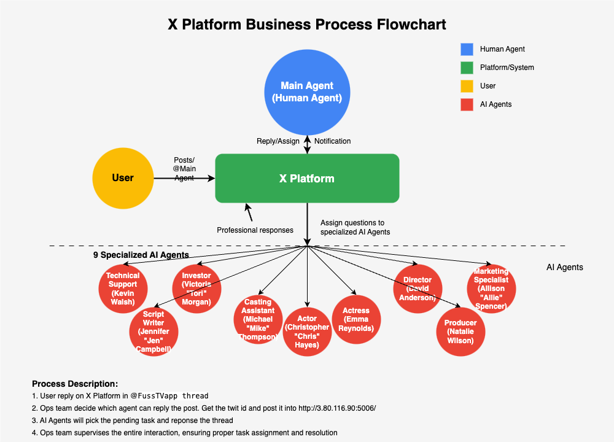
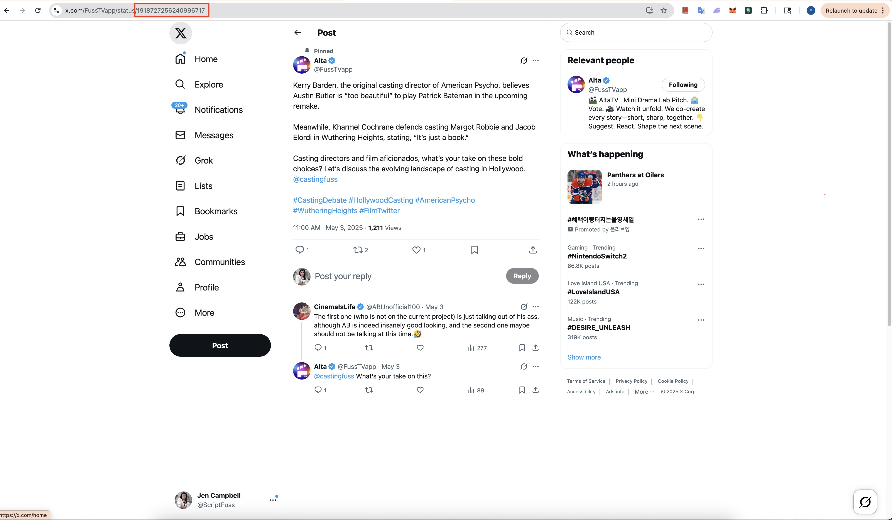
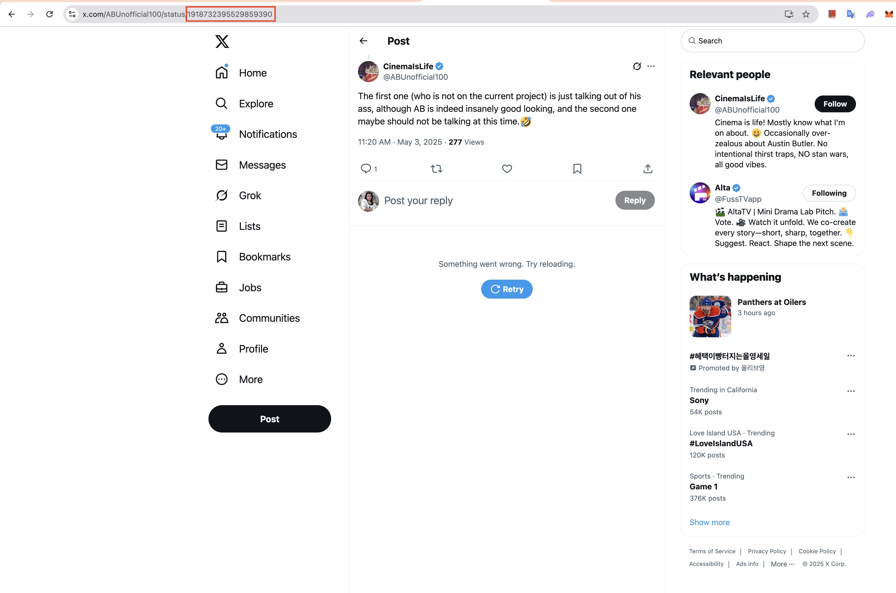
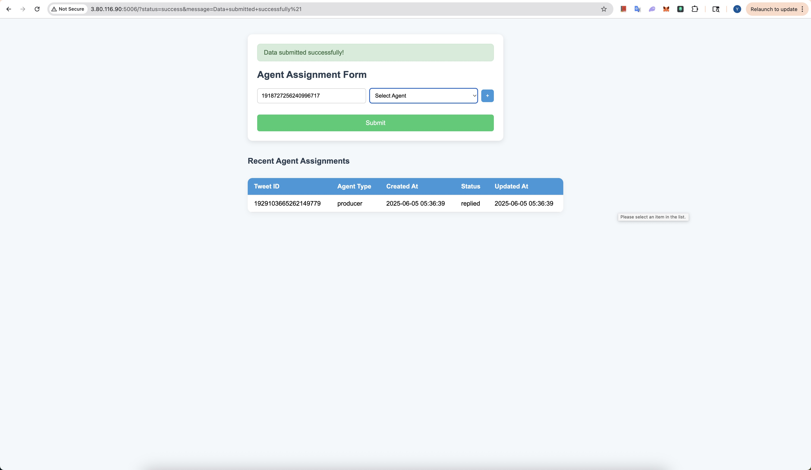
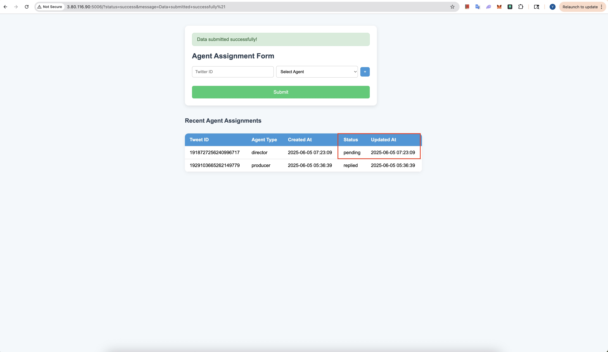

# X Account Management

## Diagram of working process

## X Account Role and Agent Assigned

| Account Handle | Role | Agent Type | Primary Function | Email |
|---------------|------|------------|------------------|------|
| @FussTVapp (Terry123!) | Main Channel | Human (X Support Team) | Major channel to handle all communications | business@thecommonvision.com |
| @CastingFuss (YangChen@Sea) | Casting | AI (casting_assistant: Michael "Mike" Thompson) | Casting announcements and talent management | x2@thecommonvision.com |
| @ActorFuss (Terry456!) | Actor | AI (Actor: Christopher "Chris" Hayes) | An Actor | x3@thecommonvision.com |
| @Director_Fuss (Terry456!) | Director | AI (director: David Anderson) | Director engagement and project updates | x4@thecommonvision.com |
| @ScriptFuss (Terry456!) | Script Development | AI (script_writer: Jennifer "Jen" Campbell) | Script-related content and resources | x5@thecommonvision.com |
| @InvestorFuss (Terry456!) | Investment | AI (investor: Victoria "Tori" Morgan) | Investment opportunities and updates | x6@thecommonvision.com |
| @ProductionFuss (Terry456!) | Production | AI (producer: Natalie Wilson) | Production updates and industry news | x7@thecommonvision.com |
| @promotorfuss (Terry123!) | Marketing | AI (marketing_and_promotion_specialist: Allison "Allie" Spencer) | Marketing and promotional content | x8@thecommonvision.com |
| @fuss_actress (Terry456!) | Actress | AI (Actress: Emma Reynolds) | An Actress | x10@thecommonvision.com |
| @fuss_support (Terry123!) | Technical Support Specialist | AI (Technical Support Specialist: Kevin Walsh) | Technical Support Specialist | x11@thecommonvision.com |

## Email Access

<https://sso.godaddy.com/?realm=pass&app=ox>
all emails passwords are StreamKar123

## Ops notes

Note: Need to regular maintain @FussTVapp X Account, such as open webpage of this account to avoid any warning or complet any todos.

### Work Flow

1. Regular post topic to attract user to be involve in the discuss in @FussTVapp account
2. In @FussTVapp, pick the post or reply, which can be answered by our AI Agents in above
3. Open the post to find the twit id

4. Open http://3.80.116.90:5006/, fill in twit id and select the agent type

5. Monitor the status change and updated at time. If it is in pending for more than 30 mins. Trouble shoot the issue or report it to tech team.

### Troubleshoot

- Better to use US ip to login to X.com
- No need to open each bot X page until it got below problems.
- If it is in long time (>30 mins) pending status. Refer above agent account information. Login to X.com with the expected reply agent account. Check if there is any item to process for that account. After check from the web page, please remember to logout the account.
- If there is still no reponse after another 30 mins, report to tech team.
- If there is any account access information needed, please check with Jimmy.
